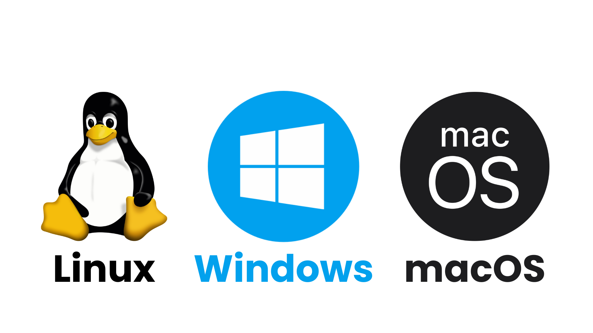

# Kompyuterlarni tushunish

## Kompyuter nima?

Kompyuterlar har yerda mavjud — noutbuklardan smartfonlargacha va aqlli soatlarga qadar — ular hayotimizni qanday yashashimizni o'zgartirib bormoqda. Ammo siz hech o'ylab ko'rganmisiz, kompyuter aslida nima?

Kompyuter — bu ma'lumotlarni qayta ishlaydigan elektron qurilma. U ma'lumotlarni 1 va 0 shaklida ko'radi, ammo ularni murakkab shakllarga, masalan, fotosuratlar, filmlar, veb-saytlar, o'yinlar va boshqa narsalarga aylantirishni biladi.

### Haqiqiy hayotdagi taqqoslash:

Kompyuterni yuqori texnologiyali yordamchi deb o'ylang. Xuddi shaxsiy yordamchi sizning jadvalingizni tashkil qilishi, elektron pochta xabarlarini yuborishi va vazifalarni bajarishi mumkin bo'lganidek, kompyuter bu funksiyalarni ma'lumotlarni qayta ishlash va siz bergan buyruqlarni bajarish orqali amalga oshiradi.

Kompyuterlar ikki asosiy tarkibiy qismga tayanadi:

1. **Apparat (Hardware)**: Kompyuterning fizik qismlari, shu jumladan ichki komponentlar (masalan, protsessor) va tashqi qismlar (masalan, monitor va klaviatura).
2. **Dasturiy ta'minot (Software)**: Aparatga nima qilish kerakligini aytadigan ko'rsatmalar to'plami, masalan, veb-brauzerlar, media pleerlar va matn protsessorlari.

Odamlar odatda kompyuter haqida gapirganda, shaxsiy kompyuterlarni nazarda tutadilar. Bu ish stoli (desktop) yoki noutbuk bo'lishi mumkin, ular portativroq bo'lishiga qaramay, bir xil imkoniyatlarga ega. Shaxsiy kompyuterlarning turlari quyidagilardir:

- **Windows kompyuterlari**: Windows operatsion tizimidan foydalanadi.
- **Macintosh (Mac)**: macOS tizimi bilan jihozlangan.
- **Chromebooklar**: Chrome OS tizimida ishlaydi.

Teleradiolar, o'yin konsollari va hatto muzlatkichlar kabi boshqa qurilmalarda ham ichki kompyuterlar bo'lishi mumkin. Ushbu qurilmalar ish stoli yoki noutbuk kabi hamma narsani bajara olmasa ham, ular hayotimizda muhim rol o'ynaydi.

## Apparat va Dasturiy ta'minot

Barcha kompyuterlarning ikkita asosiy komponenti bor: **apparat** va **dasturiy ta'minot**.

### Apparat

Apparat — bu kompyuteringizning fizik tuzilmasiga ega bo'lgan har qanday qism, masalan:

- **Tashqi apparat**: Klaviatura, sichqoncha, monitor.
- **Ichki apparat**: Protsessor(CPU), Operativ hotira(RAM), ona marta(motherboard).

### Haqiqiy hayotdagi taqqoslash:

Apparat — bu ustaxonadagi asboblar kabi. Masalan, klaviatura buyrug'larni kiritishda foydalaniladigan bolg'a kabi, Protsessor esa asboblar yordamida ishlovchi hunarmandga o'xshaydi.

### Dasturiy ta'minot

Dasturiy ta'minot — bu apparatga nima qilish kerakligini aytadigan ko'rsatmalar to'plami. Misollar:

- **Veb-brauzerlar**: Internetga kirish uchun.
- **O'yinlar**: Ko'ngil ochar dasturlar.
- **Matn protsessorlari**: Hujjatlarni yaratish va tahrirlash uchun.

### Haqiqiy hayotdagi taqqoslash:

Dasturiy ta'minot hunarmandni yo'naltiruvchi loyiha yoki ko'rsatmalarga o'xshaydi. Yo'riqnomasiz asboblar (apparat) nima qilish kerakligini bilmaydi.

Kompyuterdagi har bir harakat apparat va dasturiy ta'minotdan foydalanadi. Masalan, hozir ushbu darsni veb-brauzer (dasturiy ta'minot) orqali o'qish sichqoncha (apparat) yordamida amalga oshiriladi.

## Operatsion tizim nima?

**Operatsion tizim (OS)** — bu kompyuterda ishlaydigan eng muhim dasturiy ta'minot. U kompyuterning xotirasini, jarayonlarini, dasturlarini va apparatini boshqaradi, sizga kompyuter bilan muloqot qilish imkonini beradi. Operatsion tizimsiz kompyuter foydasiz bo'ladi.

Operatsion tizim siz bilan kompyuter o'rtasida til almashuvchi rolini o'ynaydi, sizning harakatlaringizni kompyuter tushunadigan buyruqlarga aylantiradi.

### Haqiqiy hayotdagi taqqoslash:

Operatsion tizimni turli tillarda gaplashadigan odamlar o'rtasidagi tarjimon deb tasavvur qiling. Tarjimon har bir ishtirokchi bir-birini tushunishini va muloqot tartibli bo'lishini ta'minlaydi.

### Operatsion tizim turlari

Operatsion tizimlar odatda kompyuterga oldindan o'rnatilgan holda keladi. Ko'p odamlar o'z kompyuteriga o'rnatilgan operatsion tizimdan foydalanadi, ammo uni yangilash yoki almashtirish ham mumkin. Eng keng tarqalgan operatsion tizimlar:

#### Microsoft Windows

- Microsoft tomonidan 1980-yillarda ishlab chiqilgan.
- Misollar: Windows 10, Windows 8, Windows 7, Windows Vista.
- Ko'p kompyuterlarda oldindan o'rnatilgan bo'lib, dunyodagi eng mashhur operatsion tizimdir.

### Haqiqiy hayotdagi taqqoslash:

Windows mashhur tez ovqatlanish restoranlari tarmog'iga o'xshaydi. U keng tarqalgan, ko'pchilikka tanish va har kim uchun mos narsa taklif qiladi.

#### macOS

- Apple tomonidan Macintosh kompyuterlari uchun ishlab chiqilgan.
- Misollar: Mojave, High Sierra, Sierra.
- Apple kompyuterlari qimmatroq bo'lgani uchun dunyo bo'ylab kamroq ishlatiladi, lekin ko'pchilik uning dizayn va funksiyalarini afzal ko'radi.

### Haqiqiy hayotdagi taqqoslash:

macOS yuqori darajadagi butik do'koniga o'xshaydi. U noyob dizayn, yuqori sifat taklif etadi va ko'proq to'lashga tayyor bo'lganlar uchun jozibador.

#### Linux

- Ochiq manba kodli operatsion tizim, uni har kim o'zgartirishi va tarqatishi mumkin.
- Misollar: Ubuntu, Linux Mint, Fedora.
- Moslashuvchanligi va bepul bo'lgani uchun serverlarda keng tarqalgan.
- Kopchilik ishlatadigan Android ham Linux asosida kurilgan.

### Haqiqiy hayotdagi taqqoslash:

Linux moslashtiriladigan retseptga o'xshaydi. Uni o'zingizga mos ravishda sozlashingiz, erkin ulashishingiz va o'z ehtiyojlaringizga moslashingiz mumkin.

#### Mobil operatsion tizimlar

Mobil qurilmalar teginish interfeysi uchun maxsus ishlab chiqilgan operatsion tizimlardan foydalanadi, masalan:

- **Apple iOS**: iPhone va iPadlarda ishlatiladi.
- **Google Android**: Ko'pgina smartfonlar va planshetlarda ishlatiladi. Android ham Linux asosida yaratilgan.

Ushbu tizimlar kichik ekranlar va teginish orqali ishlash uchun optimallashtirilgan, ammo ular ish stoli operatsion tizimlari kabi ko'p funksiyalarni taklif etadi.

### Haqiqiy hayotdagi taqqoslash:

Mobil operatsion tizimlar kichik vositalar to'plamiga o'xshaydi. Ular to'liq ustaxonaning barcha xususiyatlariga ega emas, ammo kichik, sayohatda ishlatiladigan vazifalar uchun yetarli.

### Operatsion tizimning roli

OS kompyuterning barcha resurslarini boshqaradi, jumladan:

- **CPU**: Barcha ishlaydigan dasturlar protsessor quvvatini samarali taqsimlashini ta'minlaydi.
- **Xotira**: RAMni ilovalarga ajratadi va boshqaradi.
- **Saqlash**: Ma'lumotlarni kompyuterning disklarida tashkil qiladi va ulardan foydalanadi.

## Grafik interfeys (GUI) va Buyruqlar satri interfeysi (CLI)

Zamonaviy operatsion tizimlar foydalanuvchilarga tizim bilan o'zaro aloqada bo'lish uchun odatda Grafikli Foydalanuvchi Interfeysi (GUI) dan foydalanadi. Bu interfeys orqali ikonka, tugmalar va menyular yordamida ishlash mumkin. Boshqa tomondan, Komanda-Satr Interfeysi (CLI) foydalanuvchilardan vazifalarni bajarish uchun matnli buyruqlar yozishni talab qiladi.

### Haqiqiy hayotdagi taqqoslash:

- **GUI:** GUI dan foydalanish, xarid qilish markazida ochiq belgilar, eskalatorlar va xaritalar yordamida osongina manzilingizga borishga o'xshaydi.
- **CLI:** CLI dan foydalanish esa, do'kon xodimiga inventar haqida to'liq ma'lumotga ega bo'lgan holda kerakli narsani aniq tasvirlab berishga o'xshaydi.

---

## Ochiq manba va yopiq manba dasturlar

### Ochiq manba va yopiq manba nima?\*\*

Barcha dasturlar manba kodi yordamida yaratiladi — bu dastur qanday ishlashini ko'rsatadigan texnik chizma. Dastur yaratuvchilari bu kodni ochiq manba yoki yopiq manba qilishni tanlashlari kerak:

- **Yopiq manba dastur (Proprietary Software):** Manba kodi ommaga ochilmaydi, foydalanuvchilar uni ko'rish yoki o'zgartirish imkoniyatiga ega emas.
- **Ochiq manba dastur:** Manba kodi ommaga ochiq, har kim uni ko'rishi, o'zgartirishi yoki baham ko'rishi mumkin.

### Haqiqiy hayotdagi taqqoslash:

- **Yopiq manba dastur:** Bu restoranning maxfiy retseptiga o'xshaydi. Siz taomdan bahramand bo'lasiz, lekin retseptni ko'rish yoki o'zgartirish imkoniyati yo'q.
- **Ochiq manba dastur:** Bu ommaga taqdim etilgan retseptga o'xshaydi, uni o'zingizning didingizga moslashtirishingiz mumkin.

#### Misollar:\*\*

- **Yopiq manba dastur:** Microsoft Office, Adobe Photoshop, Windows.
- **Ochiq manba dastur:** LibreOffice, Firefox, Linux, WordPress.

#### Afzalliklar va kamchiliklar

**Ochiq manba dastur:**

- **Afzalliklari:** Odatda bepul, ommaviy hamkorlik orqali takomillashtirilgan, yuqori darajada moslashtiriladigan.
- **Kamchiliklari:** Foydalanuvchilar uchun qulay emas, yordam cheklangan bo'lishi mumkin.

**Yopiq manba dastur:**

- **Afzalliklari:** Barqaror, foydalanuvchilar uchun qulay, maxsus mijozlarga xizmat ko'rsatish mavjud.
- **Kamchiliklari:** Odatda pulli, yangilanishlar va tuzatishlar uchun yaratuvchiga bog'liq.
